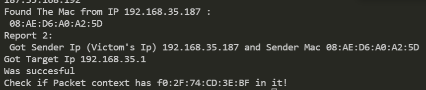

# send-arp from CYDF 300

Practices many concept, including pcap_send, ethernet, arp header structure, and how arp's broadcasting api can be used to create an attack.

To use, compile the source code and follow the "usage".

```
syntax : send-arp <interface> <sender ip> <target ip> [<sender ip 2> <target ip 2> ...]
sample : send-arp wlan0 192.168.10.2 192.168.10.1
```

# If successful...

<p align="center">
  
</p>


# Which leads to...

<p align="center">
  
</p>
